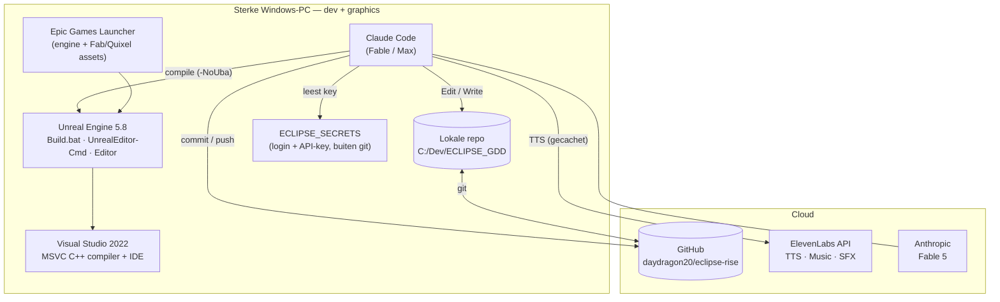
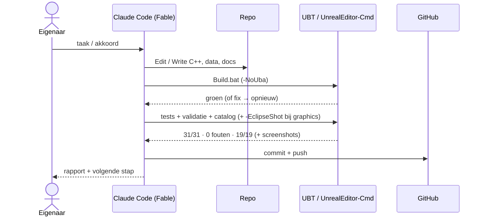

# ECLIPSE — MIGRATIE NAAR DE STERKE PC (het complete dag-één-draaiboek)
*Dit document is het draaiboek voor de nieuwe (RTX-)computer. Laatst bijgewerkt: 2026-07-22 (Fable 5-sessie). De eigenaar plakt §7 (DE BOOTSTRAP-PROMPT) letterlijk in Claude Code op de nieuwe machine; Claude doet daar de rest — en vraagt bij ELKE installatie of download eerst toestemming, met uitleg waarvoor het is.*

---

## 0. Hoe dit document werkt

1. **Voor de eigenaar:** op de nieuwe PC installeer je alleen Node.js + Claude Code (§2, stap 1), kopieer je `ECLIPSE_SECRETS` van de USB naar `C:\Dev\`, en **dubbelklik je `C:\Dev\ECLIPSE_SECRETS\start_fable.bat`** — dan draait Fable meteen met het juiste (Max-)account, los van een eventueel eigen Claude-account op die PC. Plak dan de prompt uit §7. Alles daarna doet Claude, met jouw akkoord per installatie/download.
2. **Voor Claude op de nieuwe PC:** dit document is jouw opdracht. Volg het **consent-protocol** (§1) zonder uitzondering. De secties §3–§6 zijn je inhoudelijke kader: wat er al af is, het asset-beleid van de eigenaar, en de eerlijke werkverdeling laptop ↔ RTX-PC.

---

## 1. HET CONSENT-PROTOCOL (owner-instructie, verplicht)

De eigenaar krijgt beveiligingsmeldingen liever niet onverwacht, en degene die akkoorden/codes kan geven is niet vaak aanwezig. Daarom, op elke machine:

- **Vóór elke download, installatie, account-koppeling of Windows-beveiligingsprompt:** leg in één of twee zinnen uit (a) WAT je wil installeren/downloaden, (b) WAARVOOR het nodig is, (c) hoe groot het ongeveer is — en **wacht op expliciet akkoord** van de eigenaar.
- **Bundel** prompts waar mogelijk: liever één keer "ik ga nu A, B en C installeren, mag dat?" dan drie losse verrassingen.
- **Vermijd** alles wat stilletjes een firewall/UAC-prompt triggert. Bekende valkuil: de Unreal-buildaccelerator (UBA) opent een netwerkpoort → bouw altijd met **`-NoUba`** tenzij de eigenaar de firewallprompt al heeft geaccepteerd.
- Geen akkoord (eigenaar afwezig)? **Werk door aan alles wat geen installatie vraagt** en zet de installatie-wensen in een nette wachtrij in je eindrapport.

---

## 2. Wat er op de nieuwe PC nodig is (elke installatie mét reden)

De eigenaar hoeft vooraf alleen **stap 1** zelf te doen; Claude regelt de rest ná akkoord per stap.

| # | Wat | Waarvoor | Omvang (ca.) |
|---|---|---|---|
| 1 | **Node.js LTS + Claude Code** (`npm i -g @anthropic-ai/claude-code`) | De AI-ontwikkelaar zelf — dit document wordt eraan gevoerd | ~200 MB |
| 2 | **Git + GitHub CLI** (winget: `Git.Git`, `GitHub.cli`) | De repo clonen en pushen (code + design-bible + historie) | ~400 MB |
| 3 | **Visual Studio 2022 Community** met workload **"Game development with C++"** | De MSVC-compiler waarmee Unreal C++ bouwt; ook de IDE die open staat met de gamefiles | ~10–20 GB |
| 4 | **Epic Games Launcher** → **Unreal Engine 5.8** | De game-engine zelf (editor + build-tools) | ~40–60 GB |
| 5 | **Python 3** (winget `Python.Python.3.12`) | De catalog-check (`check_event_catalog.py`) en tooling-scripts | ~100 MB |
| 6 | *(pas in de asset-fase, apart akkoord)* **Fab / Quixel Megascans-toegang** via het Epic-account | Gratis AAA-assetbibliotheek (gebouwen-kits, props, materialen) voor de art-pass — zie asset-beleid §5 | per pack 0,5–5 GB |

**Geen andere installaties zonder vraag.** VS Code is optioneel (de eigenaar kijkt mee via de Claude Code-terminal of de VS-IDE); als de eigenaar het wil: winget `Microsoft.VisualStudioCode` + de Claude-extensie.

### Secrets + de Fable-start (NOOIT via git of chat)
De map **`C:\Dev\ECLIPSE_SECRETS`** van de laptop wordt met USB/beveiligde kopie meegenomen naar de nieuwe PC (zelfde pad: `C:\Dev\ECLIPSE_SECRETS`). Inhoud en rol:

| Bestand/map | Wat | Hoe gebruikt |
|---|---|---|
| `fable-config\` | **De volledige Claude-config van het Max/Fable-account** (`rocadelobv@gmail.com`), inclusief login en projectgeheugen | Niets kopiëren: `start_fable.bat` wijst `CLAUDE_CONFIG_DIR` hierheen. **Een eventueel eigen Claude-account op de PC blijft hier volledig los van.** |
| `start_fable.bat` | **De startknop**: zet `CLAUDE_CONFIG_DIR`, gaat naar de repo-map en start `claude --model fable --effort max --dangerously-skip-permissions` | Dubbelklikken = Fable draait met het juiste account en zonder permission-prompts |
| `UserSecrets.ini` | **ElevenLabs API-key** (werkend geverifieerd 2026-07-22; scope: alleen TTS) | Kopiëren naar `C:\Dev\ECLIPSE_GDD\Eclipse\Config\UserSecrets.ini` (gitignored) — Claude begeleidt dit in de bootstrap |
| `claude-credentials.json` | Losse kopie van de Max-login | **Fallback** als de config-dir-route ooit hapert: naar `C:\Users\<jij>\.claude\.credentials.json` |
| `MIGRATION_TO_STRONG_PC.md` | Kopie van dit draaiboek | Openen in Kladblok om de §7-prompt te kunnen plakken vóórdat de repo gecloned is |

**Het startcommando (wat `start_fable.bat` doet):**
```powershell
$env:CLAUDE_CONFIG_DIR = "C:\Dev\ECLIPSE_SECRETS\fable-config"
cd C:\Dev\ECLIPSE_GDD   # of C:\ zolang de repo nog niet gecloned is
claude --model fable --effort max --dangerously-skip-permissions
```
`--dangerously-skip-permissions` betekent: Claude wordt niet per tool-actie om toestemming gevraagd. **Daarom is het consent-protocol van §1 des te bindender** — de rem zit in het gedrag (eerst uitleggen, dan akkoord), niet in de tooling. Duurzame fallback voor de login: toegang tot de `rocadelobv@gmail.com`-inbox → wachtwoord-reset op claude.ai → normale `/login`.

---

## 3. Stand van het project (eerlijk, per 2026-07-22)

**Af en groen op de laptop (HEAD op `main`, alles gepusht):**
- Phase 1 compleet en her-reviewd: volledige speelbare loop (menu-basis → graybox-missie met squad-orders → extractie → debrief → volgende loop), event bus, deterministische economie/campagne/save, roster + permadeath. Build ✓, **31/31 tests** ✓, datavalidatie 0 fouten ✓, event-catalog 19/19 ✓.
- **Audio-pipeline live bewezen:** eerste echte ElevenLabs-run geslaagd (8/8 squad-barks gegenereerd → WAV-cache in `Content/Audio/Generated` → `USoundWave`-import → auto-assign). Herhaalrun = 8 cache-hits, 0 API-calls ("nooit 2× dezelfde regel" werkt live). Dialogue-database is een diffbaar JSON-bestand: `Eclipse/Content/Audio/DialogueSeed.json`.
- **Besturing:** toetsenbord+muis én **Xbox-controller** (linkerstick lopen, rechterstick kijken, RT vuren, LB = agressieve stance bij orders, D-pad = squad-orders 1–4, B = hurken, stick-klik = sprint). Gamepad-gevoel (curves, deadzones) is bewust nog stub — feel-pass hoort bij Phase 2.
- **Graphics-stijltaal (deels, kalibratie loopt):** een geauthord cel/toon-materiaal `M_EclipseToon` (Unlit, licht-banden + hatching in de shader — bewezen werkend, immuun voor de SM5-lichtbugs van de laptop) + palet met hue-shifted schaduwtinten + schemer-atmosfeer. **Let op:** het oude `PP_EclipseOutline`-postmateriaal bleek het hele beeld te overschilderen (dagenlang de "paarse waas"); het is vervangen door script `Eclipse/Tools/author_outline_material.py` dat een correct scene-doorgevend inktlijn-materiaal **`PP_EclipseInk`** bouwt — **dat script is nog niet gedraaid**; tot dan rendert het district zonder lijnen (bewust, netjes afgevangen).

**Nog open (kleine, bekende punten):**
1. `author_toon_material.py` één keer draaien (nieuwe band-defaults 0.55/0.10) en `author_outline_material.py` één keer draaien (maakt `PP_EclipseInk`), daarna een `-EclipseShot`-screenshotronde ter verificatie van de kalibratie (zon –25°, exposure-bias –1.0).
2. De gate-vraag van Phase 1 (roadmap 13.2): eigenaar speelt de loop en beantwoordt *"spelen testers vrijwillig een 2e loop?"* — dat oordeel is en blijft van de eigenaar.
3. Music/SFX-endpoints + adaptieve always-on-muziek (16.7) — Phase-2 forward-infra.

---

## 4. De eerlijke werkverdeling: wat de laptop kán en wat écht hier (RTX) moet

**Kon/kan op de GTX 1050-laptop (en is/wordt daar gedaan):** alle gameplay-code en tests; de audio-pipeline; de **stijltaal** (toon-shading, palet, inktlijnen, schemer-mood, screenshot-QC-rig `-EclipseShot`); controller-support; alles headless/CI.

**Kan NIET op de laptop — dit is waarom deze PC bestaat:**
- **Lumen GI + reflecties, Nanite, Virtual Shadow Maps, hardware ray tracing, volumetrische fog, TSR** — de volle Part 15-stack (de laptop draait een SM5-fallback zonder dit alles; de forensische limieten staan als comments in `EclipseGrayboxBuilder.cpp`).
- **4K/8K-textures en zware asset-bibliotheken** (4 GB VRAM is te weinig).
- **De echte art-pass**: blokken vervangen door echte gebouw-kits, props, decals, personages — zie het asset-beleid hieronder. Geen enkele shader-truc maakt van kubussen een stad; dit is de stap die het beeld naar "moderne AAA" tilt.

---

## 5. ASSET-BELEID (owner-mandaat 2026-07-22 — bindend)

1. **Grote/algemene assets worden gedownload**, niet zelf gemaakt: gebouwen-kits, straatprops, materialen/textures, vegetatie, generieke personage-basis — uit **Fab / Quixel Megascans** (gratis bij het Epic-account) of professionele packs. Elke download: eerst uitleggen wat + waarvoor + omvang, dan akkoord vragen (§1).
2. **Écht belangrijke dingen worden met de hand gebouwd** — hero-assets die de identiteit van ECLIPSE dragen (bv. de Gate Spire, Dominion-propaganda, de memorial, key-personages). **Maar pas** wanneer het resultaat **minstens even goed is als de gedownloade assets / de Borderlands-lat**. Tot die kwaliteit haalbaar is: een gedownload/aangepast asset als placeholder gebruiken en het hero-asset op de takenlijst houden.
3. **De gelockte art-richting blijft staan:** gestileerd, Borderlands-leunend (`15_visual_quality_charter.md` §15.5) — NIET fotorealistisch. Gedownloade (vaak realistische) assets worden **gerestyled** in de toon-pijplijn: het cel-banden-materiaal, palet-discipline en inktlijnen liggen er als laag overheen; kwaliteit zit in silhouet en detail, stijl zit in de shading.
4. Alles blijft **binnen de performance-budgetten** (12.4) en achter UE-scalability.

---

## 6. Werkwijze op deze PC (samenvatting; details in de repo-docs)

- Leesvolgorde bij elke nieuwe sessie: `HANDOFF.md` → `PROGRESS.html` (viewer; data bijwerken in `progress_data.js`, **nooit** PROGRESS.html of `progress_auto.js` zelf bewerken) → `phase0/OWNER_MANDATE.md` → `DOCUMENTATION_README.md` → `00_INDEX.md` → `13_roadmap.md` (ACTIVE_MILESTONE) → `14_ai_dev_instructions.md` → `15`/`16`/`17`.
- Cadans: kleine stappen — build → tests → validatie → catalog → commit `[Systeem] Werkwoord samenvatting (GDD-ref)` → push. Werkboom schoon achterlaten; `HANDOFF.md` ("LAATSTE STAND") + `progress_data.js` elke sessie bijwerken.
- Screenshot-QC: `-game -windowed -resx=1280 -resy=720 -EclipseShot` (vaste review-camera's; PNG's in `Eclipse\Saved\Screenshots\WindowsEditor`) — elke graphics-pass beoordelen op de 15.8-loop (zwakste punt zoeken → fixen → opnieuw).
- De Python-materiaal-scripts draaien headless: `UnrealEditor-Cmd <project> -run=pythonscript -script="<repo>\Eclipse\Tools\<script>.py" -EnablePlugins=PythonScriptPlugin -unattended -nopause -nosplash`.

---

## 7. DE BOOTSTRAP-PROMPT — dit plakt de eigenaar in Claude Code op de nieuwe PC

> Voorwaarde: Claude Code is geïnstalleerd (§2 stap 1) en gestart in een willekeurige map. Kopieer ALLES in het blok hieronder.

```text
Je bent de ECLIPSE-ontwikkelaar (Fable 5, Max-plan) op de nieuwe sterke Windows-PC. Je
bent gestart via C:\Dev\ECLIPSE_SECRETS\start_fable.bat (CLAUDE_CONFIG_DIR wijst naar de
vault, permission-modus is bypass — het consent-protocol hieronder is daarom BINDEND
gedrag, niet optioneel). Jouw taak: deze machine volledig inrichten en daarna het
ontwikkelwerk starten. Het draaiboek staat in MIGRATION_TO_STRONG_PC.md — nu al leesbaar
in C:\Dev\ECLIPSE_SECRETS\, na het clonen ook in de repo
https://github.com/daydragon20/eclipse-rise (branch main).

STRIKTE REGEL (consent-protocol): vóór ELKE download, installatie, account-koppeling of
actie die een Windows-beveiligingsprompt kan geven, zeg je eerst in 1-2 zinnen WAT het is,
WAARVOOR het nodig is en HOE GROOT het ongeveer is — en wacht je op mijn akkoord.
Bundel akkoorden waar mogelijk. Zonder akkoord: doorwerken aan wat wél kan en de rest
in een wachtrij zetten. Bouw Unreal altijd met -NoUba (geen firewallprompts).

DOE DIT, IN VOLGORDE (vraag per stap akkoord waar het protocol dat eist):
  1. Controleer de machine: Windows-versie, GPU (verwacht RTX-klasse), vrije schijfruimte
     (minstens ~150 GB voor engine + project + assets). Rapporteer kort.
  2. Installeer met mijn akkoord, in deze volgorde, en leg per item uit waarvoor het is:
     Git + GitHub CLI · Python 3 · Visual Studio 2022 Community met de workload
     "Game development with C++" · Epic Games Launcher → Unreal Engine 5.8.
     (Claude Code draait al — daarin praat je nu met mij.)
  3. Clone de repo: git clone https://github.com/daydragon20/eclipse-rise.git C:\Dev\ECLIPSE_GDD
     (github-login via gh auth login --web als dat nodig is — leg uit, vraag akkoord).
  4. Secrets: C:\Dev\ECLIPSE_SECRETS staat al op deze pc (USB) en jij draait al op het
     Max-account via de vault-config — controleer dat met /model (Fable 5) en meld het.
     Kopieer alleen nog UserSecrets.ini → C:\Dev\ECLIPSE_GDD\Eclipse\Config\UserSecrets.ini
     (ElevenLabs-key, gitignored — nooit in git of chat).
  5. Zet UE_ROOT (C:\Program Files\Epic Games\UE_5.8), genereer Visual Studio-projectfiles
     voor C:\Dev\ECLIPSE_GDD\Eclipse\Eclipse.uproject en bouw:
       & "$env:UE_ROOT\Engine\Build\BatchFiles\Build.bat" EclipseEditor Win64 Development
         -project="C:\Dev\ECLIPSE_GDD\Eclipse\Eclipse.uproject" -WaitMutex -NoUba
  6. Draai de volledige groene bar en rapporteer de cijfers:
     tests (Automation RunTests Eclipse, headless -nullrhi; verwacht 31/31) ·
     -run=EclipseValidateData (0 fouten) · python Eclipse\Tools\check_event_catalog.py (19/19).
  7. Draai de twee materiaal-scripts (headless, geen prompts) en daarna één
     -EclipseShot-screenshotronde; toon mij de shots:
       Eclipse\Tools\author_toon_material.py  en  Eclipse\Tools\author_outline_material.py
  8. Open Visual Studio met de solution (C:\Dev\ECLIPSE_GDD\Eclipse\Eclipse.sln) zodat ik
     de gamefiles voor me heb. Vraagt VS om een Microsoft-account-login (Community-licentie),
     leg dat uit en laat mij inloggen. Bevestig de eindstaat: VS open met de solution ·
     Claude Code op Fable 5/max (vault-config) · repo gebouwd en groen · screenshots gezien.
  9. Lees daarna ZELF, zonder overslaan: HANDOFF.md (incl. "LAATSTE STAND") →
     MIGRATION_TO_STRONG_PC.md §3-§6 (status, werkverdeling, ASSET-BELEID, werkwijze) →
     phase0/OWNER_MANDATE.md → DOCUMENTATION_README.md → 00_INDEX.md → 13_roadmap.md
     (ACTIVE_MILESTONE) → 14_ai_dev_instructions.md → 15_visual_quality_charter.md →
     16_audio_system.md. Vat in 10 regels samen waar het project staat.
 10. Vraag mij dan: "Zal ik met het ontwikkelwerk beginnen?" Het ontwikkelwerk is, in volgorde:
     (A) onafhankelijke her-verificatie van de groene bar; (B) de graphics-kalibratie afronden
     (toon-banden, PP_EclipseInk-inktlijnen, screenshot-QC) en dan de echte Part 15-fidelity-
     pass met de volle stack (Lumen/Nanite/VSM/HWRT, gestileerd Borderlands-leunend — 15.5 is
     gelockt, NIET fotorealistisch); (C) de art-pass volgens het ASSET-BELEID in §5: algemene
     assets downloaden via Fab/Quixel (per download uitleg + mijn akkoord), hero-assets pas
     met de hand bouwen wanneer dat op gelijk kwaliteitsniveau kan; (D) gamepad-feel-pass,
     Music/SFX-endpoints en adaptieve muziek (16.7) als Phase-2-infra. Werk in kleine,
     geteste, gecommitte en gepushte stappen; de Game Design Bible is leidend; werkboom
     schoon achterlaten; HANDOFF.md en progress_data.js elke sessie bijwerken.
```

---

## 8. Referentie: architectuur-diagrammen (ongewijzigd geldig)

### 8.1 Componenten



### 8.2 De dev-loop



---

*Dit document reist mee in de repo. Zie ook `HANDOFF.md` (start-hier), `SETUP.md` (toolchain-details), `phase0/OWNER_MANDATE.md` (audio/graphics-mandaat + AAA-werkwijze).*
