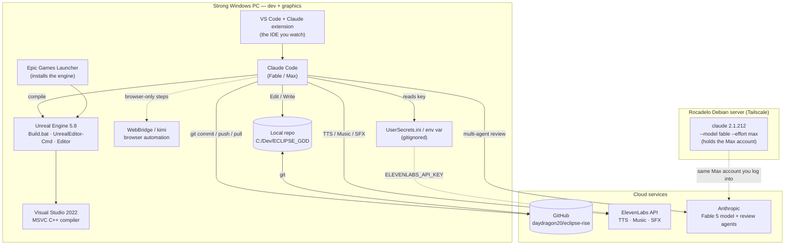
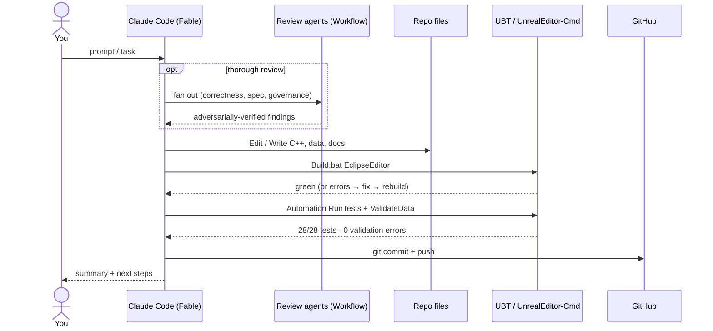
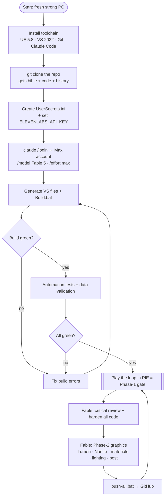

# ECLIPSE — MIGRATION TO THE STRONG PC (full-day setup guide)
*How to move the entire workflow to a stronger Windows PC, run the Max plan + Fable there, handle secrets safely, and hand off to Fable for graphics + a code re-review. Diagrams included. Last updated 2026-07-22.*

> Read this top to bottom. The actual data transfer is mostly **one `git clone`** — the repo already holds the design bible AND the code AND the full history. The rest is toolchain, the Claude Max/Fable login, and secrets. The final section is a **ready-to-paste prompt** for Fable on the strong PC.

---

## 0. TL;DR (the whole thing in 8 lines)

1. On the strong PC, install the toolchain (`SETUP.md`): **UE 5.8 + VS 2022 (Game dev C++) + Git + Claude Code**.
2. `git clone https://github.com/daydragon20/eclipse-rise.git C:\Dev\ECLIPSE_GDD` — this is 95% of the transfer.
3. Copy `Eclipse/Config/UserSecrets.ini.example` → `UserSecrets.ini`, put the ElevenLabs key in it (gitignored).
4. Install **Claude Code**, run `claude`, `/login` with the **Max account** (`rocadelobv@gmail.com`) → you now have Fable on the strong PC.
5. `/model` → **Fable 5**, `/effort` → **max**.
6. Build (`Build.bat EclipseEditor …`), run the tests, confirm green.
7. Play the loop in PIE (that's the Phase-1 gate).
8. Paste the **final prompt** (§6) so Fable re-reviews the code and starts the Phase-2 graphics.

---

## 1. What moves, and why the strong PC

| | This laptop (dev box) | The strong PC (target) |
|---|---|---|
| Role | graybox logic, CI, everything so far | **graphics/fidelity (Phase 2+)** + a Fable review pass |
| GPU | GTX 1050 4 GB — no ray tracing | RTX-class — Lumen HWRT, Nanite, 4K textures |
| Claude | Opus (nathan@charut.be, Pro) | **Fable (Max account)** |

The GTX 1050 can run the *ugly graybox* fine but cannot represent shipping visuals (see `15_visual_quality_charter.md` §15.2). So the strong PC exists to do the **graphics**, exactly what Part 15 describes — and to let **Fable** re-examine and harden what Opus built.

**The server is not the target.** The Rocadelo Debian server holds the Max account login, but it is **Linux and not GPU-strong**, so it cannot run Unreal at all. We are *not* moving work onto the server — we are moving the **Max/Fable *account*** onto the strong Windows PC (see §4).

---

## 2. The whole workflow, explained (with diagrams)

This is what "Claude does" actually looks like end to end — how I touch the engine, the agents, VS Code, git, ElevenLabs, and the server, and how it ties to the tools you install.

### 2.1 Component view (UML-style)



### 2.2 My inner dev loop (UML sequence)

Every task I run follows this shape — build-verify-test-commit, with an optional agent fan-out:



### 2.3 The setup process (BPMN-style)



### 2.4 What each interaction actually is

- **Claude Code ↔ Unreal Engine.** I never "open the editor and click." I drive UE headlessly: `Build.bat EclipseEditor Win64 Development` to compile the C++, `UnrealEditor-Cmd … -ExecCmds="Automation RunTests Eclipse"` to run the test suite, and `-run=EclipseValidateData` to validate the content assets. The editor GUI (Play-In-Editor) is **your** part — I can't click Play, so the human playtest is yours.
- **Claude Code ↔ Visual Studio 2022.** VS2022 is not an IDE I use interactively; it's the **compiler** (MSVC) that `Build.bat` invokes under the hood. It must have the "Game development with C++" workload or UE can't build.
- **Claude Code ↔ VS Code.** VS Code is the window *you* watch; the Claude extension shows the conversation. The actual work happens through my tools, not by typing in the editor.
- **Claude Code ↔ agents (Workflow).** For thorough passes I fan out to parallel sub-agents (e.g. correctness / spec-compliance / governance reviewers), then adversarially verify each finding before acting. That's how the CRITICAL Focus-target bug was caught and confirmed.
- **Claude Code ↔ git / GitHub.** Every logical change is a commit with a `[System] Verb summary (GDD ref)` message; I push to `daydragon20/eclipse-rise`. `push-all.bat` is your manual safety-net for the same thing.
- **Claude Code ↔ ElevenLabs.** The audio subsystem calls the ElevenLabs REST API for TTS, keyed by the env var / `UserSecrets.ini`. Results are cached by content hash so nothing is generated twice.
- **Claude Code ↔ WebBridge (kimi).** For browser-only steps (Epic login, GitHub auth pages) I can drive the browser via the local kimi bridge.
- **Claude Code ↔ the server.** The server holds the Max account and can run its own `claude` (Fable), but it can't build Unreal. On the strong PC we bring the *account* over by logging in — see §4.

---

## 3. Step-by-step: set up the strong PC

### Step 1 — Install the toolchain
Follow **`SETUP.md`** (in this repo) exactly. Summary: `winget` installs Git, GitHub CLI, Node, Python, Claude Code, and VS 2022 with the **NativeGame** workload; then the Epic Games Launcher installs **Unreal Engine 5.8** (large download — kimi can drive the Epic login). Set `UE_ROOT` to `C:\Program Files\Epic Games\UE_5.8`.

### Step 2 — Get the project (this is the "transfer")
```powershell
gh auth login --hostname github.com --git-protocol https --web    # log in to GitHub
git clone https://github.com/daydragon20/eclipse-rise.git C:\Dev\ECLIPSE_GDD
```
That single clone brings **everything**: the design bible (`00`–`17`), the specs, the UE project under `Eclipse/`, all 17 commits of history, `HANDOFF.md`, `SETUP.md`, and this file.

### Step 3 — Secrets (see §5 for the full vault)
```powershell
cd C:\Dev\ECLIPSE_GDD\Eclipse\Config
copy UserSecrets.ini.example UserSecrets.ini
notepad UserSecrets.ini      # paste the ElevenLabs key; the file is gitignored
```
Or set a machine/user env var instead:
```powershell
[Environment]::SetEnvironmentVariable("ELEVENLABS_API_KEY", "sk_...", "User")
```

### Step 4 — The Max plan + Fable (the important one)
The Max/Fable plan lives on the **Anthropic account**, not on the server — it just happens to be logged in there today. The account is **`rocadelobv@gmail.com`** (Rocadelo BV). Two ways to get it onto the strong PC:

**Option 1 — normal login (needs the account password):**
```powershell
claude            # first run opens login
/login            # "Log in with Claude subscription", account rocadelobv@gmail.com
/model            # Fable 5
/effort           # max
```

**Option 2 — copy the session (NO password needed).** Claude Code stores its login as a plain file on both Linux and Windows, and there is no keyring on the server, so the session is transferable:
- Server file: `/home/edwin/.claude/.credentials.json` (perms 600 — it's a secret; treat it like one).
- Strong-PC target: `C:\Users\<you>\.claude\.credentials.json`.
```powershell
# On the strong PC, after installing Claude Code (so ~/.claude exists) and CLOSING it:
scp edwin@100.103.118.98:/home/edwin/.claude/.credentials.json "$env:USERPROFILE\.claude\.credentials.json"
# (needs the rocadelo_key in ~/.ssh and Tailscale up; or copy the file by USB)
claude            # launches already logged in as rocadelobv@gmail.com
/model            # Fable 5
```
If Claude still shows logged-out after the copy, the token needs its account context — fall through to Option 3.

**Option 3 — the durable fix (recover the password).** `rocadelobv@gmail.com` is the Rocadelo BV company inbox. Whoever controls that Gmail can do a password reset at claude.ai → then Option 1 works forever, on any machine. This is the one to arrange so you're never locked out again.

> **Security:** `.credentials.json` holds OAuth tokens. Never commit it, never paste it in chat, never put it in the repo. It is not covered by `git` here (it lives in your home dir, not the project).

### Step 5 — Build + verify green
```powershell
$env:UE_ROOT = "C:\Program Files\Epic Games\UE_5.8"
& "$env:UE_ROOT\Engine\Build\BatchFiles\Build.bat" EclipseEditor Win64 Development -project="C:\Dev\ECLIPSE_GDD\Eclipse\Eclipse.uproject" -WaitMutex
& "$env:UE_ROOT\Engine\Binaries\Win64\UnrealEditor-Cmd.exe" "C:\Dev\ECLIPSE_GDD\Eclipse\Eclipse.uproject" -ExecCmds="Automation RunTests Eclipse; quit" -unattended -nopause -nosplash -nullrhi -log -ReportExportPath="C:\Dev\ECLIPSE_GDD\Eclipse\Saved\Automation"
```
Expect: build **Succeeded**, **28/28** tests, **0** validation errors. Then open `Eclipse.uproject` and **Play** to walk the loop.

---

## 4. The Max / Fable account (server reference + commands)

The Claude subscription is **account-bound**, so "moving it" = logging into the same account on the new machine. For reference, here is how it runs on the server today and what to watch for:

- **Account:** `rocadelobv@gmail.com` (banner shows the plan). This is the account to `/login` with on the strong PC.
- **Two installs on the server (a known trap):** `/usr/bin/claude` is **old (2.1.191) and does NOT know Fable**; `/home/edwin/.npm-global/bin/claude` is **new (2.1.212) and Fable works**. On the strong PC just install the current Claude Code (`npm i -g @anthropic-ai/claude-code`) so this trap doesn't apply.
- **The flags the server uses for Fable:**
  ```bash
  /home/edwin/.npm-global/bin/claude --model fable --effort max --dangerously-skip-permissions --continue
  ```
  On the strong PC the GUI equivalents are `/model` → Fable 5 and `/effort` → max.
- **Fable credit caveat (be honest with yourself here):** Fable 5 was free in-plan **until 2026-07-19**; that window has now passed, so heavy Fable use may draw on **usage credits**. If Fable says "usage credits required," either enable credits on that account or fall back to Opus/Sonnet for the bulk and use Fable where it matters most.
- **`ultracode` is local-only.** It's a mode of *this* desktop harness, not a server/CLI feature. On the strong PC's Claude Code, use `/effort max` and, for a cloud multi-agent review, `ultrareview` / `/code-review ultra`.
- **Reaching the server if you need it** (you usually won't for game work): SSH host `rocadelo-edwin` (user edwin) at `76.13.57.153`, Tailscale `100.103.118.98`, key `rocadelo_key`. The server is for the RecruitmentAI business, not for building ECLIPSE.

---

## 5. Secrets vault — secure but reachable

Principle: **secrets live outside git, in a place both you and the tools can read, and are transferred by hand — never committed, never pushed.** A pre-push scan (`git grep sk_`) guards every push.

| Secret | Where it lives (strong PC) | How to transfer | In git? |
|---|---|---|---|
| **ElevenLabs API key** | `Eclipse/Config/UserSecrets.ini` **or** env `ELEVENLABS_API_KEY` | password manager / copy by hand | **Never** (gitignored) |
| **Claude Max login** | Claude Code's own secure store, via `/login` | log in on the machine (OAuth) | Never (not a file) |
| **GitHub auth** | `gh` credential store, via `gh auth login` | log in on the machine | Never |
| **Server SSH key** (only if you need the server) | `~/.ssh/rocadelo_key` | copy the key file by USB / secure channel, then restrict perms | Never |

`UserSecrets.ini`, `*.secret`, and `.env` are already in `.gitignore`. **Rotate the ElevenLabs key** that was shared in plaintext, then put the fresh one in `UserSecrets.ini`.

> Want it even tidier? Keep all four in a password manager (e.g. Bitwarden/1Password). The strong PC pulls each into its proper place once; nothing sensitive ever touches the repo.

---

## 6. THE PROMPT — paste this into Claude Code (Fable, Max) on the strong PC

> Copy everything in the box below into a new Claude Code session on the strong PC, in the folder `C:\Dev\ECLIPSE_GDD`, after `/login` (Max account) → `/model` Fable 5 → `/effort` max.

```text
You are the ECLIPSE strong-PC dev, running as Fable 5 on the Max plan. The repo is
at C:\Dev\ECLIPSE_GDD (a single git repo: design bible at the root, the UE 5.8 game
under Eclipse\, remote = https://github.com/daydragon20/eclipse-rise, branch main).

FIRST, read in this order and do NOT skip:
  1. HANDOFF.md            (status, what's done, how to build/run, what's next)
  2. MIGRATION_TO_STRONG_PC.md  (this machine's setup + the diagrams)
  3. DOCUMENTATION_README.md → 00_INDEX.md → 13_roadmap.md (ACTIVE_MILESTONE)
  4. 14_ai_dev_instructions.md (coding standards + architecture constitution)
  5. 15_visual_quality_charter.md and 16_audio_system.md (your graphics + audio target)

CONTEXT: Opus built Phase 1 over 17 commits — the full playable loop (menu base →
graybox mission with a squad of 2 and orders → extraction → debrief → next loop),
an event bus, deterministic economy/campaign/save, roster+permadeath, and a cached
ElevenLabs voice pipeline. Build is green on UE 5.8, 28/28 automation tests pass,
data validation is clean, event catalog is 19/19.

ENVIRONMENT: UE_ROOT = C:\Program Files\Epic Games\UE_5.8. Build with
  & "$env:UE_ROOT\Engine\Build\BatchFiles\Build.bat" EclipseEditor Win64 Development -project="C:\Dev\ECLIPSE_GDD\Eclipse\Eclipse.uproject" -WaitMutex
Test with
  & "$env:UE_ROOT\Engine\Binaries\Win64\UnrealEditor-Cmd.exe" "C:\Dev\ECLIPSE_GDD\Eclipse\Eclipse.uproject" -ExecCmds="Automation RunTests Eclipse; quit" -unattended -nopause -nosplash -nullrhi -log -ReportExportPath="C:\Dev\ECLIPSE_GDD\Eclipse\Saved\Automation"
Validate with -run=EclipseValidateData. Commit as "[System] Verb summary (GDD ref)".
Push with git, or run push-all.bat. The ElevenLabs key comes from the env var
ELEVENLABS_API_KEY or Eclipse\Config\UserSecrets.ini — never put a key in source or git.

YOUR JOB, in order:

PHASE A — Independent re-review of Opus's work (do this first; don't trust, verify).
  - Re-read every committed C++ system critically (Core/event bus, Strategy/campaign,
    Economy, Quests/mission, Squad, Base/prep, Characters, Combat, AI, Audio, UI).
  - Re-run the full green bar (build + tests + validation + event catalog). Fix any
    real defect you find with a minimal, tested change. Do NOT rewrite working,
    tested code just to restyle it — improve where it's genuinely wrong or unclear,
    and add tests where coverage is thin. Report what you changed and why.
  - Clear the known small items in HANDOFF.md §5 (squad stance stub; move the
    hardcoded squad tuning constants into DA_SquadTuning).

PHASE B — Verify the playable loop.
  - Confirm the Phase-1 loop plays end to end in PIE with no console commands.
  - The gate question (roadmap 13.2) — "do testers voluntarily play a second loop?" —
    is the owner's call; surface it, don't self-declare it passed.

PHASE C — Graphics / fidelity (this is why you're on the strong PC; follow Part 15).
  - Stay inside the ACTIVE_MILESTONE for GAMEPLAY, but begin the Phase-2 visual
    foundation the strong hardware unlocks: enable/verify Lumen (hardware RT where
    available), Nanite on suitable geometry, Virtual Shadow Maps, TSR, volumetric
    fog, physically-based exposure and a filmic post chain — all behind UE
    scalability so min-spec still runs. Replace the graybox cubes of the first
    district with Megascan/Nanite materials and intentional lighting per the art
    direction (15.5), keeping the 12.4 performance budgets. Profile on this GPU and
    report stat unit / GPU numbers.
  - Do NOT let graphics work regress the Phase-1 loop or the green test bar.

Work in small, reviewed, committed steps. After each meaningful change: build, test,
commit, push. Keep the design bible authoritative — if something conflicts, the Game
Design Bible wins, and never invent lore outside 00_INDEX.md. Begin with Phase A.
```

---

*This document lives in the repo, so it travels with every clone. Prev/next: see `HANDOFF.md` (start-here) and `SETUP.md` (toolchain).*
